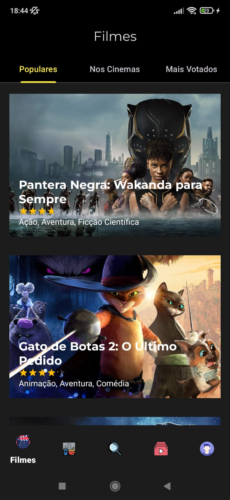
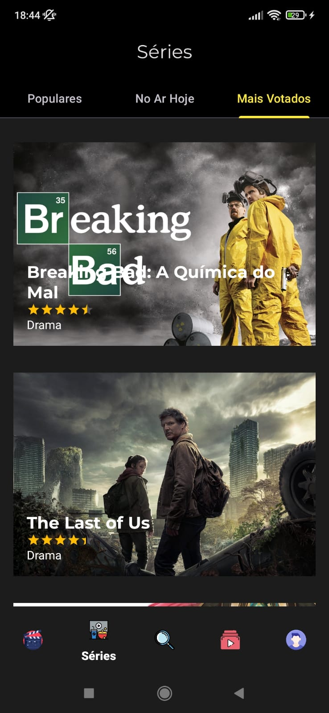
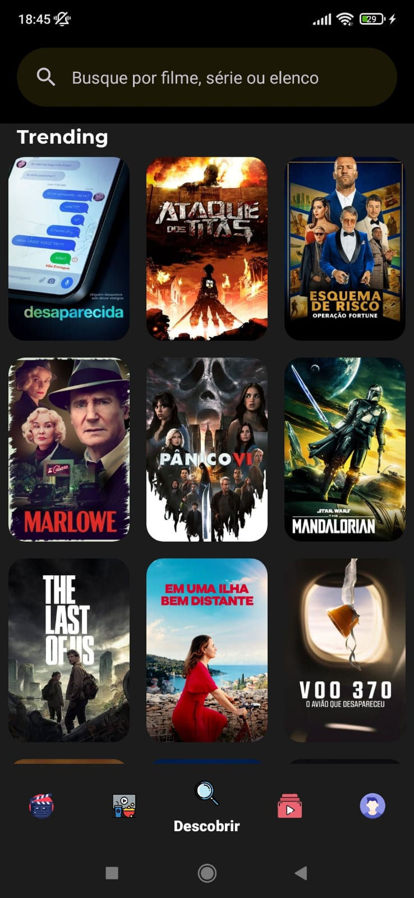
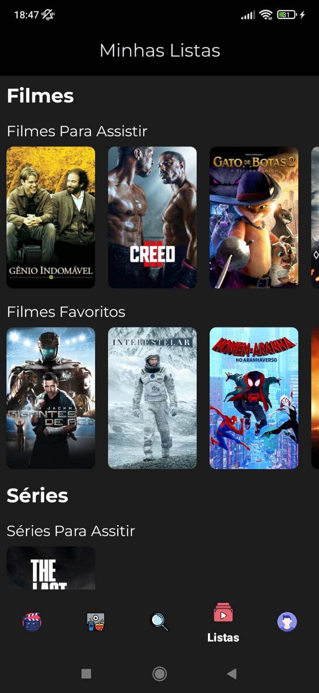
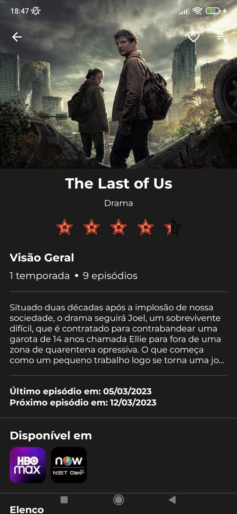

# CineTime

Um aplicativo Android Nativo de filmes e séries, desenvolvido em Kotlin, apoiado principalmente sobre a API do <a href="https://www.themoviedb.org/documentation/api">TheMovieDB (TMDB)</a>
e sobre o <a href="https://firebase.google.com/?hl=pt-br">Firebase</a>. Ele se baseia em Clean Architecture + MVVM, e busca utilizar as stacks do Android mais recentes, juntamente com as 
melhores práticas de desenvolvimento.

> Confira algumas das telas do aplicativo!

    

## :construction: :construction: :construction: :construction: